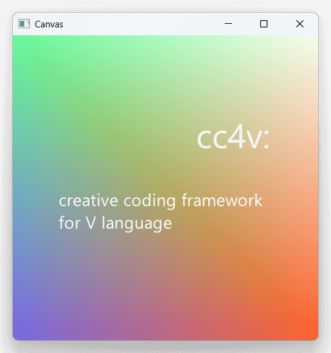

# cc4v



(code of above: [examples/logo_icon](https://github.com/cc4v/cc4v-examples/blob/main/logo-icon/main.v))

> [!WARNING]
> Currently at early stage. API design may be changed in the future.<br>
> (see [docs/coverage.md](docs/coverage.md))

Creative Coding framework in [V language](https://vlang.io/)

Aiming to provide APIs like [openFrameworks](https://openframeworks.cc/documentation/) or [Processing](https://processing.org/reference) on top of V / [gg](https://modules.vlang.io/gg.html), with a little essence of [Ebitengine](https://ebitengine.org/). (Please check [docs/api_design.md](docs/api_design.md))

Tested on V 0.4.12

## Features

- Run as fast as C/C++/Rust even with GC, and coding style is so much fun just like scripting language. (Thanks to [V language](https://vlang.io/))
- Works on Win/Mac/Linux, on D3D11/Metal/GL/WebGL2/WebGPU. (Thanks to [Sokol framework](https://github.com/floooh/sokol))
- APIs are similar to [openFrameworks](https://openframeworks.cc/) or [Processing](https://processing.org/).
- You can use GL-compatible draw call using Sokol GL. (OpenGL 1.x style immediate-mode rendering API on top of sokol_gfx.h)

## Install

```bash
$ git clone https://github.com/cc4v/cc4v ~/.vmodules/cc
```

## Examples

see [cc4v-examples](https://github.com/cc4v/cc4v-examples) and [docs/coverage.md](docs/coverage.md).

```bash
# NOTE: You should not use ~/.vmodules for this clone
#       Please `cd ~/Documents` or somewhere else.

$ git clone https://github.com/cc4v/cc4v-examples
$ cd cc4v-examples
$ v run ./hello_world
```

## Contribution

Please check [docs/api_design.md](docs/api_design.md), [docs/coverage.md](docs/coverage.md), and [LICENSE.md](LICENSE.md).

Fork and create your version as you like. Feel free to create PR. If you have any questions or ideas, please use [discussions](https://github.com/cc4v/cc4v/discussions) instead of issues. Issues are only for task tracking.
